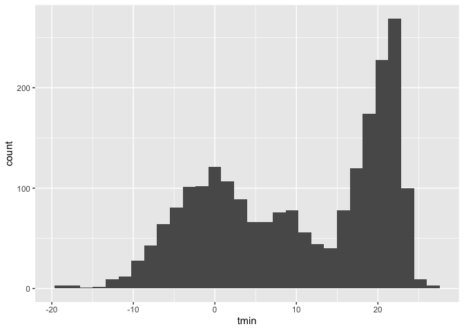
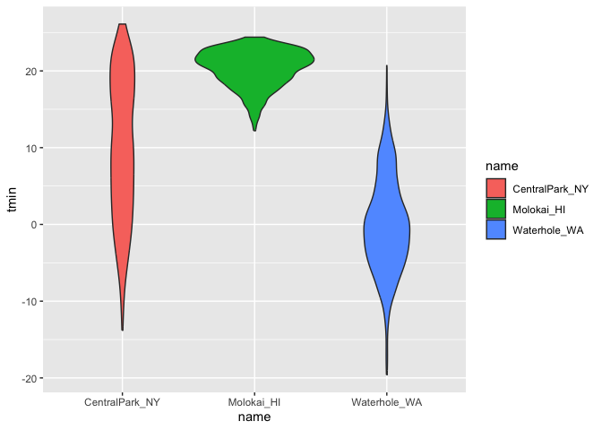
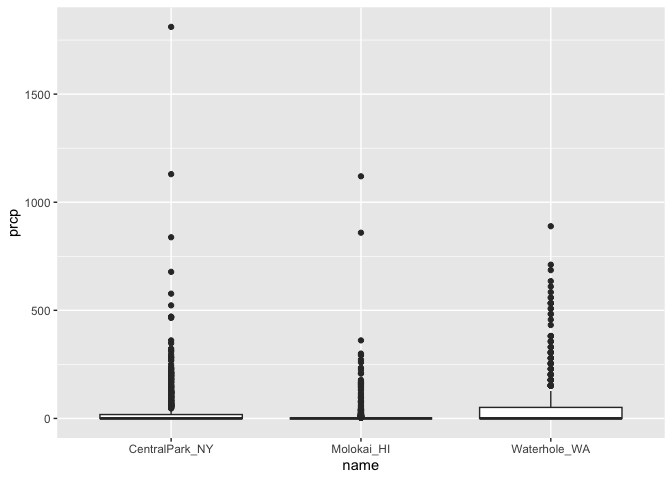
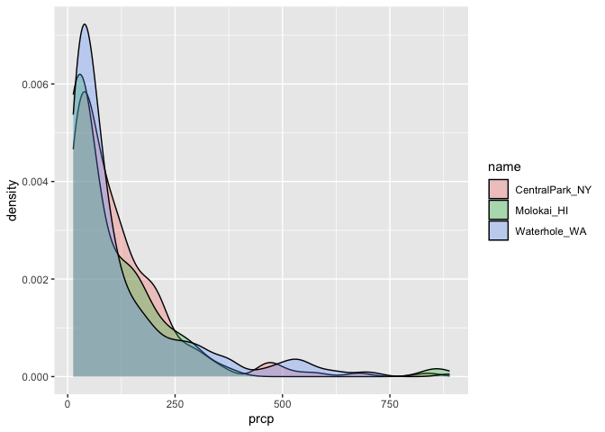

Visualization and EDA
================
Kamiah Brown
2024-09-26

``` r
library(tidyverse)
```

    ## ── Attaching core tidyverse packages ──────────────────────── tidyverse 2.0.0 ──
    ## ✔ dplyr     1.1.4     ✔ readr     2.1.5
    ## ✔ forcats   1.0.0     ✔ stringr   1.5.1
    ## ✔ ggplot2   3.5.1     ✔ tibble    3.2.1
    ## ✔ lubridate 1.9.3     ✔ tidyr     1.3.1
    ## ✔ purrr     1.0.2     
    ## ── Conflicts ────────────────────────────────────────── tidyverse_conflicts() ──
    ## ✖ dplyr::filter() masks stats::filter()
    ## ✖ dplyr::lag()    masks stats::lag()
    ## ℹ Use the conflicted package (<http://conflicted.r-lib.org/>) to force all conflicts to become errors

``` r
library(ggridges)
```

``` r
weather_df = 
  rnoaa::meteo_pull_monitors(
    c("USW00094728", "USW00022534", "USS0023B17S"),
    var = c("PRCP", "TMIN", "TMAX"), 
    date_min = "2021-01-01",
    date_max = "2022-12-31") |>
  mutate(
    name = case_match(
      id, 
      "USW00094728" ~ "CentralPark_NY", 
      "USW00022534" ~ "Molokai_HI",
      "USS0023B17S" ~ "Waterhole_WA"),
    tmin = tmin / 10,
    tmax = tmax / 10) |>
  select(name, id, everything())
```

    ## using cached file: /Users/kamiahbrown/Library/Caches/org.R-project.R/R/rnoaa/noaa_ghcnd/USW00094728.dly

    ## date created (size, mb): 2024-09-26 10:22:10.295546 (8.651)

    ## file min/max dates: 1869-01-01 / 2024-09-30

    ## using cached file: /Users/kamiahbrown/Library/Caches/org.R-project.R/R/rnoaa/noaa_ghcnd/USW00022534.dly

    ## date created (size, mb): 2024-09-26 10:22:18.906464 (3.932)

    ## file min/max dates: 1949-10-01 / 2024-09-30

    ## using cached file: /Users/kamiahbrown/Library/Caches/org.R-project.R/R/rnoaa/noaa_ghcnd/USS0023B17S.dly

    ## date created (size, mb): 2024-09-26 10:22:21.652484 (1.036)

    ## file min/max dates: 1999-09-01 / 2024-09-30

Making our first plot

``` r
ggplot(weather_df, aes(x = tmin, y = tmax)) + 
  geom_point()
```

    ## Warning: Removed 17 rows containing missing values or values outside the scale range
    ## (`geom_point()`).

<!-- -->

``` r
weather_df |>
  ggplot(aes(x = tmin, y = tmax)) +
  geom_point()
```

    ## Warning: Removed 17 rows containing missing values or values outside the scale range
    ## (`geom_point()`).

<!-- -->

``` r
ggplot(weather_df, aes(x = tmin, y = tmax, color = name)) + 
  geom_point( alpha = .3, size = .8)
```

    ## Warning: Removed 17 rows containing missing values or values outside the scale range
    ## (`geom_point()`).

<!-- -->

``` r
geom_smooth(se = FALSE)
```

    ## geom_smooth: na.rm = FALSE, orientation = NA, se = FALSE
    ## stat_smooth: na.rm = FALSE, orientation = NA, se = FALSE
    ## position_identity

Where you define aesthetics can matter

``` r
ggplot(weather_df, aes(x = tmin, y = tmax, color = name)) + 
  geom_point(aes(color = name), alpha = .3, size = .8)
```

    ## Warning: Removed 17 rows containing missing values or values outside the scale range
    ## (`geom_point()`).

<!-- -->

``` r
geom_smooth(se = FALSE)
```

    ## geom_smooth: na.rm = FALSE, orientation = NA, se = FALSE
    ## stat_smooth: na.rm = FALSE, orientation = NA, se = FALSE
    ## position_identity

Use faceting; three different panels by each name

``` r
weather_df |>
  ggplot(aes(x = tmin, y = tmax, color = name)) +
  geom_point(alpha = .3) +
  geom_smooth(se = FALSE) + 
  facet_grid(. ~ name)
```

    ## `geom_smooth()` using method = 'loess' and formula = 'y ~ x'

    ## Warning: Removed 17 rows containing non-finite outside the scale range
    ## (`stat_smooth()`).

    ## Warning: Removed 17 rows containing missing values or values outside the scale range
    ## (`geom_point()`).

<!-- -->

interesting scatterplot

``` r
weather_df |>
  ggplot(aes(x = date, y = tmax, color = name, size = prcp)) +
  geom_point( alpha = .3) + 
  geom_smooth(se = FALSE)
```

    ## Warning: Using `size` aesthetic for lines was deprecated in ggplot2 3.4.0.
    ## ℹ Please use `linewidth` instead.
    ## This warning is displayed once every 8 hours.
    ## Call `lifecycle::last_lifecycle_warnings()` to see where this warning was
    ## generated.

    ## `geom_smooth()` using method = 'loess' and formula = 'y ~ x'

    ## Warning: Removed 17 rows containing non-finite outside the scale range
    ## (`stat_smooth()`).

    ## Warning: The following aesthetics were dropped during statistical transformation: size.
    ## ℹ This can happen when ggplot fails to infer the correct grouping structure in
    ##   the data.
    ## ℹ Did you forget to specify a `group` aesthetic or to convert a numerical
    ##   variable into a factor?

    ## Warning: Removed 19 rows containing missing values or values outside the scale range
    ## (`geom_point()`).

<!-- -->

``` r
  facet_grid(. ~ name)
```

    ## <ggproto object: Class FacetGrid, Facet, gg>
    ##     compute_layout: function
    ##     draw_back: function
    ##     draw_front: function
    ##     draw_labels: function
    ##     draw_panels: function
    ##     finish_data: function
    ##     init_scales: function
    ##     map_data: function
    ##     params: list
    ##     setup_data: function
    ##     setup_params: function
    ##     shrink: TRUE
    ##     train_scales: function
    ##     vars: function
    ##     super:  <ggproto object: Class FacetGrid, Facet, gg>

Learning assessment

``` r
weather_df |>
  filter(name == "CentralPark_NY") |>
  mutate(
    tmax_fahr = tmax * (9 / 5) + 32,
    tmin_fahr = tmin * (9 / 5) + 32
  ) |>
  ggplot(aes(x = tmin_fahr, y = tmax_fahr)) +
  geom_point()
```

<!-- -->

``` r
geom_smooth(method = "lm", se = FALSE)
```

    ## geom_smooth: na.rm = FALSE, orientation = NA, se = FALSE
    ## stat_smooth: na.rm = FALSE, orientation = NA, se = FALSE, method = lm
    ## position_identity

Small things

``` r
weather_df |>
  ggplot(aes(x = tmin, y = tmax)) +
  geom_point(aes(color = name), alpha = .3, size =.8) +
  geom_smooth(se = FALSE) 
```

    ## `geom_smooth()` using method = 'gam' and formula = 'y ~ s(x, bs = "cs")'

    ## Warning: Removed 17 rows containing non-finite outside the scale range
    ## (`stat_smooth()`).

    ## Warning: Removed 17 rows containing missing values or values outside the scale range
    ## (`geom_point()`).

<!-- -->

``` r
weather_df |>
  ggplot(aes(x = tmin, y = tmax)) +
  geom_hex()
```

    ## Warning: Removed 17 rows containing non-finite outside the scale range
    ## (`stat_binhex()`).

<!-- -->

``` r
weather_df |> 
  ggplot(aes(x = tmin, y = tmax)) +
  geom_point( color = "blue")
```

    ## Warning: Removed 17 rows containing missing values or values outside the scale range
    ## (`geom_point()`).

<!-- -->

``` r
weather_df |> 
  ggplot(aes(x = tmin, y = tmax, color = "blue")) +
  geom_point()
```

    ## Warning: Removed 17 rows containing missing values or values outside the scale range
    ## (`geom_point()`).

<!-- -->

If something is a variable name, it doesn’t need to be in quotes. If it
is not a variable name then it is not a variable name.

\##Univeraite plots

``` r
weather_df |>
  ggplot(aes(x = tmin)) +
  geom_histogram()
```

    ## `stat_bin()` using `bins = 30`. Pick better value with `binwidth`.

    ## Warning: Removed 17 rows containing non-finite outside the scale range
    ## (`stat_bin()`).

<!-- -->

Use fill to fill in the histogram

``` r
weather_df |>
  ggplot(aes(x = tmin, fill = name)) +
  geom_histogram()
```

    ## `stat_bin()` using `bins = 30`. Pick better value with `binwidth`.

    ## Warning: Removed 17 rows containing non-finite outside the scale range
    ## (`stat_bin()`).

<!-- -->

``` r
facet_grid(. ~ name)
```

    ## <ggproto object: Class FacetGrid, Facet, gg>
    ##     compute_layout: function
    ##     draw_back: function
    ##     draw_front: function
    ##     draw_labels: function
    ##     draw_panels: function
    ##     finish_data: function
    ##     init_scales: function
    ##     map_data: function
    ##     params: list
    ##     setup_data: function
    ##     setup_params: function
    ##     shrink: TRUE
    ##     train_scales: function
    ##     vars: function
    ##     super:  <ggproto object: Class FacetGrid, Facet, gg>

density plot

``` r
weather_df |>
  ggplot(aes(x = tmin, fill = name)) +
  geom_density(alpha = .3)
```

    ## Warning: Removed 17 rows containing non-finite outside the scale range
    ## (`stat_density()`).

<!-- --> Box plots

``` r
weather_df |>
  ggplot(aes(x = name, y = tmin, fill = name)) +
geom_boxplot()
```

    ## Warning: Removed 17 rows containing non-finite outside the scale range
    ## (`stat_boxplot()`).

<!-- --> Violin
plots

``` r
weather_df |>
  ggplot(aes(x = name, y = tmin, fill = name)) +
  geom_violin()
```

    ## Warning: Removed 17 rows containing non-finite outside the scale range
    ## (`stat_ydensity()`).

<!-- --> Ridge plots

``` r
weather_df |>
  ggplot(aes(x = tmin, y = name)) +
  geom_density_ridges()
```

    ## Picking joint bandwidth of 1.41

    ## Warning: Removed 17 rows containing non-finite outside the scale range
    ## (`stat_density_ridges()`).

<!-- -->

Learning assessment comparing prepipation across locations

``` r
weather_df |>
  ggplot(aes(x = prcp, fill = name)) +
  geom_density(alpha = 3)
```

    ## Warning: Removed 15 rows containing non-finite outside the scale range
    ## (`stat_density()`).

<!-- -->

``` r
weather_df |>
  ggplot(aes(x = name, y = prcp)) +
  geom_boxplot()
```

    ## Warning: Removed 15 rows containing non-finite outside the scale range
    ## (`stat_boxplot()`).

<!-- -->

``` r
weather_df |>
  filter(prcp > 10, prcp < 1000) |>
  ggplot(aes(x = prcp, fill = name)) +
  geom_density(alpha = .3)
```

<!-- -->

## Saving and embedding plots

``` r
ggp_weather =
  weather_df |>
  ggplot(aes(x = date, y = tmax, color = name)) +
  geom_point()

ggsave("ggp_weather.pdf", ggp_weather, width = 8, height = 6)
```

    ## Warning: Removed 17 rows containing missing values or values outside the scale range
    ## (`geom_point()`).

Embedding plots

``` r
  weather_df |>
  ggplot(aes(x = date, y = tmax, color = name)) +
  geom_point()
```

    ## Warning: Removed 17 rows containing missing values or values outside the scale range
    ## (`geom_point()`).

<!-- -->

Make a scatterplot

``` r
weather_df |> 
  ggplot(aes(x = tmin, y = tmax, color = name)) +
  geom_point(alpha = .3)
```

    ## Warning: Removed 17 rows containing missing values or values outside the scale range
    ## (`geom_point()`).

<!-- -->

``` r
labs(
  title = "Temperature scatterplot",
  x = "Minimum Temp (C)",
  y = "Maximum Temp (C)",
  color = "Location",
  caption = "Weather data taken fron rnoaa package for three stations."
)
```

    ## $x
    ## [1] "Minimum Temp (C)"
    ## 
    ## $y
    ## [1] "Maximum Temp (C)"
    ## 
    ## $colour
    ## [1] "Location"
    ## 
    ## $title
    ## [1] "Temperature scatterplot"
    ## 
    ## $caption
    ## [1] "Weather data taken fron rnoaa package for three stations."
    ## 
    ## attr(,"class")
    ## [1] "labels"

Scales –

``` r
weather_df |> 
  ggplot(aes(x = tmin, y = tmax, color = name)) +
  geom_point(alpha = .3)
```

    ## Warning: Removed 17 rows containing missing values or values outside the scale range
    ## (`geom_point()`).

<!-- -->

``` r
labs(
  title = "Temperature scatterplot",
  x = "Minimum Temp (C)",
  y = "Maximum Temp (C)",
  color = "Location",
  caption = "Weather data taken fron rnoaa package for three stations."
  ) + 
  scale_x_continuous(
    breaks = c(-15, 0, 20),
    labels = c("-15C", "0", "20")
  ) + 
  scale_y_continuous(
    limits = c(0, 30), 
    transform = "sqrt"
  )
```

    ## NULL

``` r
weather_df |> 
  ggplot(aes(x = tmin, y = tmax, color = name)) +
  geom_point(alpha = .3)
```

    ## Warning: Removed 17 rows containing missing values or values outside the scale range
    ## (`geom_point()`).

<!-- -->

``` r
labs(
  title = "Temperature scatterplot",
  x = "Minimum Temp (C)",
  y = "Maximum Temp (C)",
  color = "Location",
  caption = "Weather data taken fron rnoaa package for three stations."
) 
```

    ## $x
    ## [1] "Minimum Temp (C)"
    ## 
    ## $y
    ## [1] "Maximum Temp (C)"
    ## 
    ## $colour
    ## [1] "Location"
    ## 
    ## $title
    ## [1] "Temperature scatterplot"
    ## 
    ## $caption
    ## [1] "Weather data taken fron rnoaa package for three stations."
    ## 
    ## attr(,"class")
    ## [1] "labels"

``` r
viridis::scale_color_viridis(discrete = TRUE)
```

    ## <ggproto object: Class ScaleDiscrete, Scale, gg>
    ##     aesthetics: colour
    ##     axis_order: function
    ##     break_info: function
    ##     break_positions: function
    ##     breaks: waiver
    ##     call: call
    ##     clone: function
    ##     dimension: function
    ##     drop: TRUE
    ##     expand: waiver
    ##     get_breaks: function
    ##     get_breaks_minor: function
    ##     get_labels: function
    ##     get_limits: function
    ##     get_transformation: function
    ##     guide: legend
    ##     is_discrete: function
    ##     is_empty: function
    ##     labels: waiver
    ##     limits: NULL
    ##     make_sec_title: function
    ##     make_title: function
    ##     map: function
    ##     map_df: function
    ##     n.breaks.cache: NULL
    ##     na.translate: TRUE
    ##     na.value: NA
    ##     name: waiver
    ##     palette: function
    ##     palette.cache: NULL
    ##     position: left
    ##     range: environment
    ##     rescale: function
    ##     reset: function
    ##     train: function
    ##     train_df: function
    ##     transform: function
    ##     transform_df: function
    ##     super:  <ggproto object: Class ScaleDiscrete, Scale, gg>
